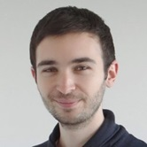

## Isabel Paredes {#identifier heading2}

### Scientific Software Developer {#identifier heading3}

Alexis is a C++ Scientific Software Engineer at Quantstack.

He obtained a Master degree in Computer Science from l'École Supérieure d'Électronique de l'Ouest of Angers in 2012.

Before joining Quanstack, Alexis worked in various companies covering a large spectrum of domains all dominated by performance constraints: signal processing, image processing, 3D meshes and metadata processing ...