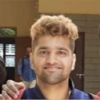

## Isabel Paredes {#identifier heading2}

### Scientific Software Developement Intern {#identifier heading3}

Anutosh is a Scientific Software Development Intern at QuantStack.

He is currently a final-year undergraduate student pursuing an Integrated Dual Degree (Bachelors & Masters) at the Indian Institute of Technology, Madras, specializing in Data Science.

His deep interest lies in Applied Mathematics, Compiler Design, and Numeric/Scientific Computing in general.
