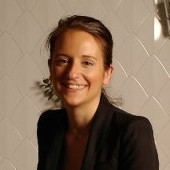

## Fanny Loustau-Chartez {#identifier heading2}

### Chief Financial Officer {#identifier heading3}

Fanny Loustau-Chartez is part time CFO at QuantStack. She holds a Master of Science from Ecole Nationale de Chimie de Paris and a Master of Entrepreneurship from HEC Business School.

Before joining QuantStack, Fanny created and managed her own restaurant in Paris for 8 years. She then occupied jobs as an executive in various small firms overseeing multiple sites' operational management, HR, cost control, administrative and finance. Since 2018, she is part-time CFO in small firms and Start Ups helping them manage and develop their businesses.
