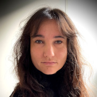

## Gabriela Vives {#identifier heading2}

### User Experience Researcher and Designer  {#identifier heading3}

Gabriela Vives is a User Experience Researcher and Designer, passionate about working in scientific domains. She first graduated with master degrees in nuclear energy and cognitive science. After working for research, she decided to continue her studies and graduated in Human-Computer Interactions. Prior to QuantStack, Gabriela worked as a User Experience Designer at Schlumberger for 4 years, conducting user research and creating user-centered interfaces for geoscience software.
