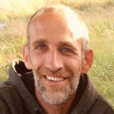

## Nicolas Brichet {#identifier heading2}

### Scientific Software Developer {#identifier heading3}

Nicolas Brichet is a Scientific Software Developer at QuantStack. He holds a master's degree in robotics from the University of Montpellier.

Prior to joining Quantstack, Nicolas worked for almost fourteen years in French research institutes (INRAE and CNRS), as software developer for scientific research. He also worked on different parts of the data lifecycle, such as data acquisition, analysis, and storage.
