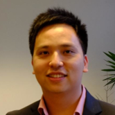

## Le Duc Trung {#identifier heading2}

### Scientific Software Developer {#identifier heading3}

Le Duc Trung is a Scientific Software Developer at
QuantStack. He holds a PhD on computational mechanics from Université Pierre-et-Marie-Curie (France).
Before joining QuantStack, Trung worked as a research engineer at Mines ParisTech, CADLM and Safran Group.

During his time at Safran, Trung was maintainer of <a href="https://gitlab.com/cosapp/cosapp">CoSApp</a>, a modeling framework relying on the Python scientific stack. He also authored <a href="https://gitlab.com/cosapp/cosapp_lab">CoSApp Lab</a>, a toolbox for creating and deploying CoSApp-powered dashboard.

As a personal project, Trung co-founded <a href="https://cast2cloud.com">Cast2cloud</a>, a web interface for the finite element
solver Cast3M.
